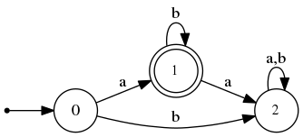

# Moory
Welcome to the Moory gem!

You can use this gem to create various kinds of finite machines using a simple specification language.

The [wiki](https://github.com/elclavijero/moory/wiki) is where to go if you are for looking for tutorial material.  Perhaps also look in the examples directory.  Therein you'll find use of the Acceptor, Decoder (Mealy machine), and something useless but (hopefully) illuminating.

Until you do, here is an example showing how you might use the Acceptor.


## Example: Creating an acceptor for ab*

### Motivation

Imagine that you want to create an incredible machine. One capable of determining whether a given character string belongs to the language described by the regular expression `ab*`.  You're not going to use a Regexp. That would be far too easy.  Instead you derive from the regular expression a Deterministic Finite Automaton (DFA) that does the job.  Here's what it might look like:



Of course, you've set up and solved a system of equations verifying that the design is correct.  Now how do you implement this in Ruby?  You won't bother trying to apply the State design pattern, because it is a pain.  Instead, you'll employ Moory, which is one of the 200+ gems that exist to make creating finite machines easy.

### Implementing the Acceptor

The first step is to install the Moory gem, achieved by issuing the following command:

```
gem install moory
```

When that's done, start up `irb` and paste the following:

```ruby
require 'moory'

ab_star = Moory::Acceptor.create(
  initial: '0',
  transitions: %q{
    0 : a : 1
    0 : b : 2
    1 : a : 2
    1 : b : 1
    2 : a : 2
    2 : b : 2
  },
  final: %w{ 1 }
)
```

I'll explain the syntax of the transitions later (see the [wiki](https://github.com/elclavijero/moory/wiki)) but you have done enough to confidently type:

```ruby
ab_star.accepts?(string: "ab")
```

and be delighted to see that the answer is `true`.

If you are naturally curious, then you might want to put `ab_star` through its paces with further candidates:

```ruby
ab_star.accepts?(string: "abbb") # => true
ab_star.accepts?(string: "aab")  # => false
ab_star.accepts?(string: "aba")  # => false
```

You aren't stuck with testing the strings against the initial state.  You can ask the machine to begin its match in any state:

```ruby
ab_star.accepts?(string: "bbb", in_state: '1') 
# => true
```

But what about including characters that don't belong to the machine's alphabet?

```ruby
ab_star.accepts?(string: "bbc", in_state: '1')
```

Well this one will be unceremoniously rejected with a runtime error (unless you are using version 0.1.0, where I forgot to handle bad input, sorry!).  Incidentally, if you want to change that behaviour, you should override the `default_proc`.
```ruby
ab_star.default_proc = proc { |msg| puts "I'm going to ignore that #{msg}" }
```

Now look
```ruby
ab_star.accepts?(string: "abcbb")
# I'm going to ignore that c
# => true
```

That's better.

### Before you go...

There's more to Moory than its Acceptor.  I'll show you how to use its other features in the [wiki](https://github.com/elclavijero/moory/wiki).


## Installation

Add this line to your application's Gemfile:

```ruby
gem 'moory'
```

And then execute:

    $ bundle

Or install it yourself as:

    $ gem install moory

## Development

After checking out the repo, run `bin/setup` to install dependencies. Then, run `rake spec` to run the tests. You can also run `bin/console` for an interactive prompt that will allow you to experiment.

To install this gem onto your local machine, run `bundle exec rake install`. To release a new version, update the version number in `version.rb`, and then run `bundle exec rake release`, which will create a git tag for the version, push git commits and tags, and push the `.gem` file to [rubygems.org](https://rubygems.org).

## Contributing

Bug reports and pull requests are welcome on GitHub at https://github.com/[USERNAME]/moory.

## License

The gem is available as open source under the terms of the [MIT License](https://opensource.org/licenses/MIT).
